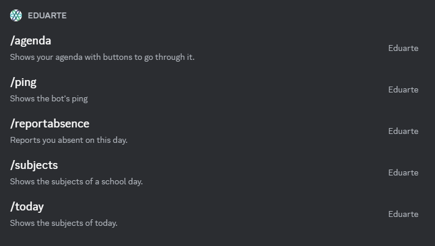

## eduarte-bot

Dit is een onofficiële Discord bot voor het Eduarte studentenportaal.

### Waarom?

Eduarte is een studentenportaal die mijn school gebruikt om het rooster vrij te geven en de absentie te regelen. Dit
betekent dat wij (de studenten) vaak moeten inloggen op dit portaal. 

Het vaak moeten inloggen en navigeren kan zorgen voor frustratie en ongemak. Deze applicatie doet het inloggen en
ophalen van de benodigde informatie zelf en laat het vervolgens zien in Discord.

### Uitdagingen
Eduarte biedt op het moment van schrijven geen API. Dit maakte het ontwikkelen van deze applicatie lastig omdat er geen mogelijkheid voor een applicatie is om data op te halen. Dit heb ik opgelost door zelf een API te schrijven die de browser requests nadoet en vervolgens de HTML van de pagina uitleest.

### Installatie

1. Clone deze Github repository.
2. Installeer NodeJS.
3. Kopieer het `.env.dist` bestand naar `.env` en vul deze in met de benodigde informatie.
4. Installeer de benodigde packages met behulp van `npm ci`.
5. Start de applicatie met `npm run dev` of build het met `npm run build`.